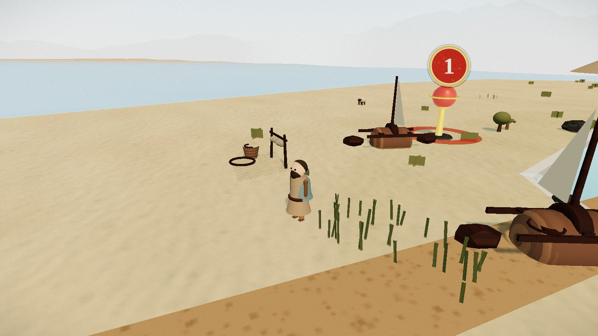

<div align="center">

# 🐟 어부의 지도 — The Fisherman's Chart

**시몬 베드로의 생애의 참된 열네 곳을 걷는 3D 웹 탐험.**
갈릴리의 그물에서 로마의 대성당까지 — 청소년을 위한 한국어 인터랙티브 성경 이야기.

<br>



<sub>갈릴리 바닷가의 첫 장면 — 그물, 배, 감람나무, 그리고 첫 번째 붉은 표지.</sub>

<br>

`Three.js r160` · `WebGL` · `Web Audio` · `빌드 없음 / No build` · `순수 절차 생성 / Fully procedural`

</div>

---

A walkable 3D chart of the fourteen true places of Simon Peter's life, from the
nets of Galilee to the basilica in Rome. Built for Korean teenagers, in Korean —
one continuous, stylized world you cross on foot in about five minutes, walking
from Galilee's morning light into the night of the Passion and back out into dawn.

## ✨ 보이는 것 / What you'll see

- **부드러운 조형** — 매끈하게 셰이딩된 인물·나무·언덕·물결. 각진 저폴리감을
  덜어내고 곡면과 실루엣을 살렸습니다.
- **하루의 시간대** — 갈릴리의 아침빛에서 예루살렘의 차가운 밤으로, 걸음에 따라
  하늘·안개·환경광이 물리 하늘(Sky)과 시간대별 환경맵으로 이어집니다.
- **살아 있는 디오라마** — 잔물결 이는 호수와 바다, 흔들리는 갈대, 뛰어오르는
  물고기, 풀 뜯는 양 떼, 느릿한 낙타 대상 — 모두 코드로 그려집니다.
- **빛과 그림자** — ACES 톤매핑, 부드러운 그림자(PCFSoft), 블룸으로 다듬은 등불과
  새벽빛.

> 매끈한 물결은 정점 법선을 매 프레임 다시 계산해 빛을 받습니다. 먼 능선은
> 낮은 각면의 원뿔에서 둥근 언덕으로, 인물과 짐승은 저폴리 구·원뿔에서
> 곡면 조형으로 다듬어졌습니다.

## 🎮 조작 / Controls

| | |
|---|---|
| **W A S D** / 방향키 | 걷기 · walk |
| 마우스 드래그 / Drag | 둘러보기 · look around |
| **Shift** | 달리기 · run |
| **E** 또는 탭 / tap | 장소 방문 · visit a place |
| **M** | 하늘에서 지도 보기 · bird's-eye chart |

모바일: 왼손 엄지로 걷고, 오른손 엄지로 봅니다.

## ▶️ 실행 / Run

빌드 과정이 없는 정적 사이트입니다. ES 모듈을 쓰므로 반드시 웹서버로 여세요
(`index.html` 더블클릭 ❌).

```bash
npx serve
# 그리고 브라우저에서 http://localhost:3000 열기
```

정적 스택: 순수 Three.js (r160, CDN import-map), Web Audio API로 합성한 소리.
게임 런타임은 오디오·이미지 파일 에셋 없이 전부 코드로 그립니다. (위 스크린샷은
문서용입니다.)

## 🗺️ 장소 / The fourteen places

| # | 장소 | Place |
|---|------|-------|
| 1 | 그물 | The nets — 갈릴리 바닷가 |
| 2 | 가버나움의 집 | The house in Capernaum |
| 3 | 물 위를 걷다 | Walking on the water |
| 4 | 가이사랴 빌립보 (반석) | Caesarea Philippi — the rock |
| 5 | 겟세마네 | Gethsemane |
| 6 | 첫 번째 불 (세 번의 부인) | The first fire — three denials |
| 7 | 골고다 (멀찍이서) | Golgotha, from afar |
| 8 | 빈 무덤 | The empty tomb |
| 9 | 긴 밤 | The long night |
| 10 | 두 번째 불 (새벽 바닷가) | The second fire — dawn shore |
| 11 | 세 번의 물음 | Three questions |
| 12 | 오순절 | Pentecost |
| 13 | 로마로 가는 항해 | The voyage to Rome |
| 14 | 거꾸로 (바티칸 언덕) | Upside down — the Vatican hill |

<div align="center"><sub>열네 곳 모두에서 만나게 되는 분은 어부가 아니라, 그를 부르시고 붙잡으시고 다시 일으키신 분입니다.</sub></div>
